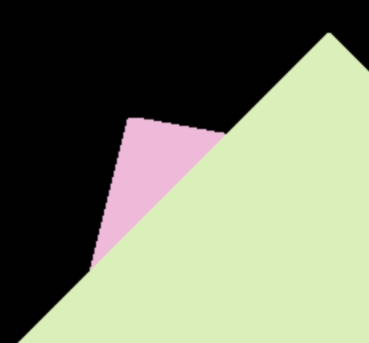
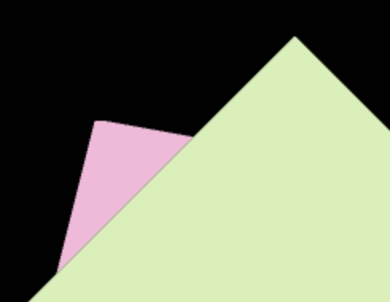

# Week 1: Games101

## Lab1

### Task 1

* 注意到angle的计数方法，仅有一个数字代表累计距离初始位置旋转了多少，而无法确定在空间中的旋转，故仅支持在平面上转动，即只按a、d或只按r，但是可以任意固定方向转。

### Task 2

* 使用MSAA抗锯齿化后明显改善

* MSAA抗锯齿化之后三角形边缘会有黑色，应该是用整点标识pixel时的细节实现问题

### Task 3

* 一片漆黑。调不出来辣！TAT
