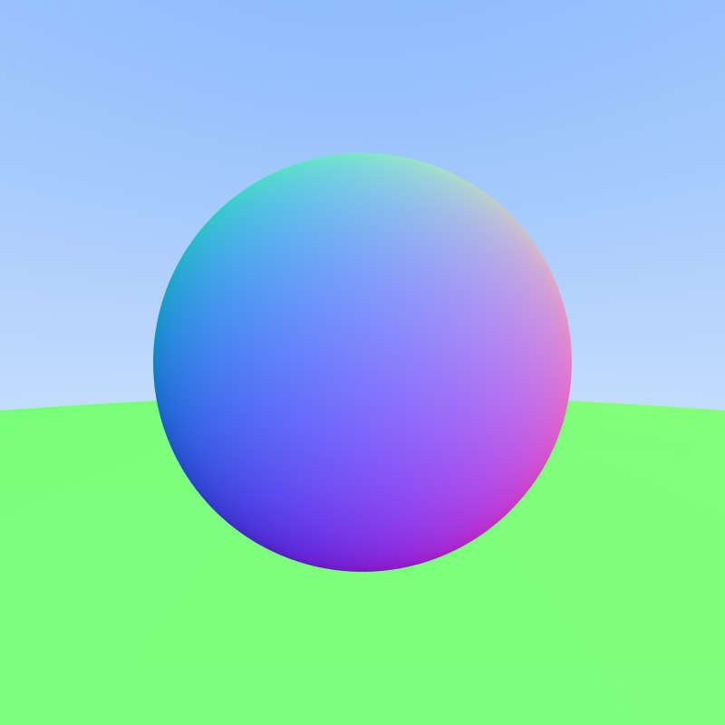
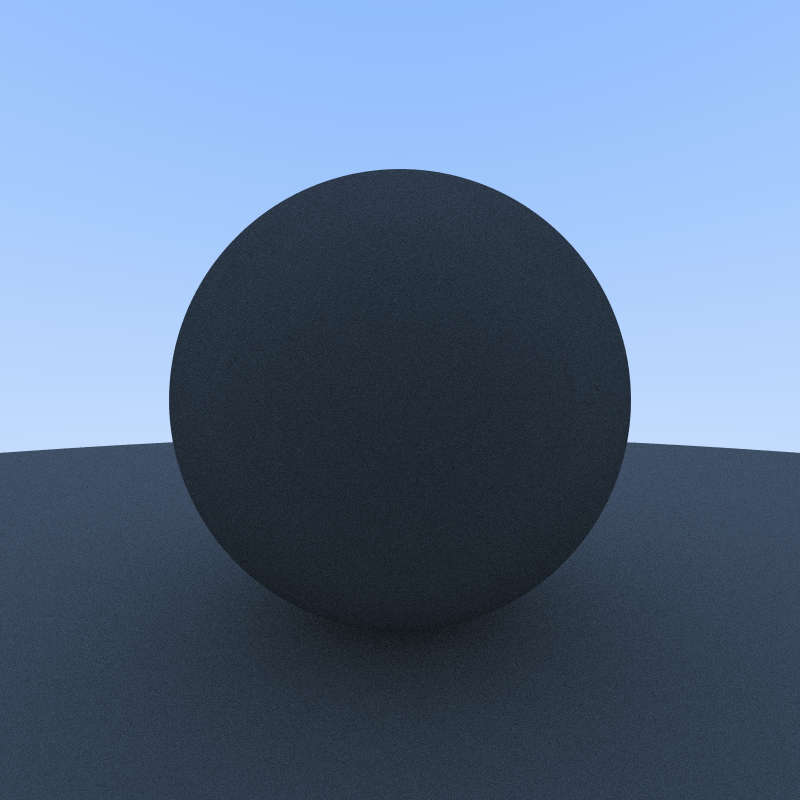
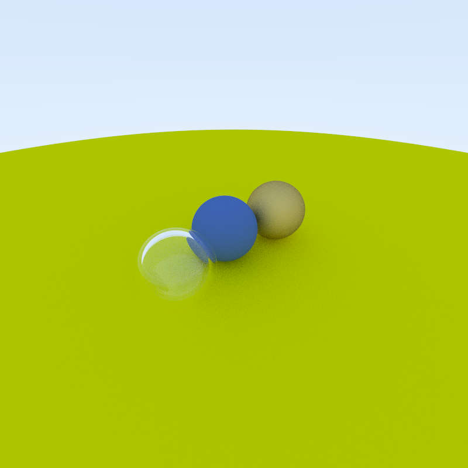
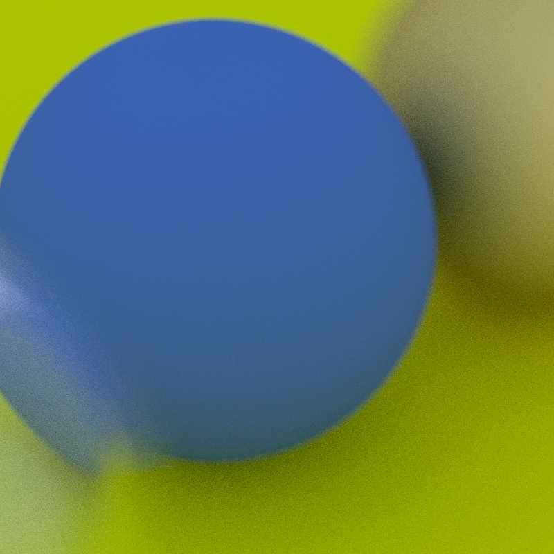
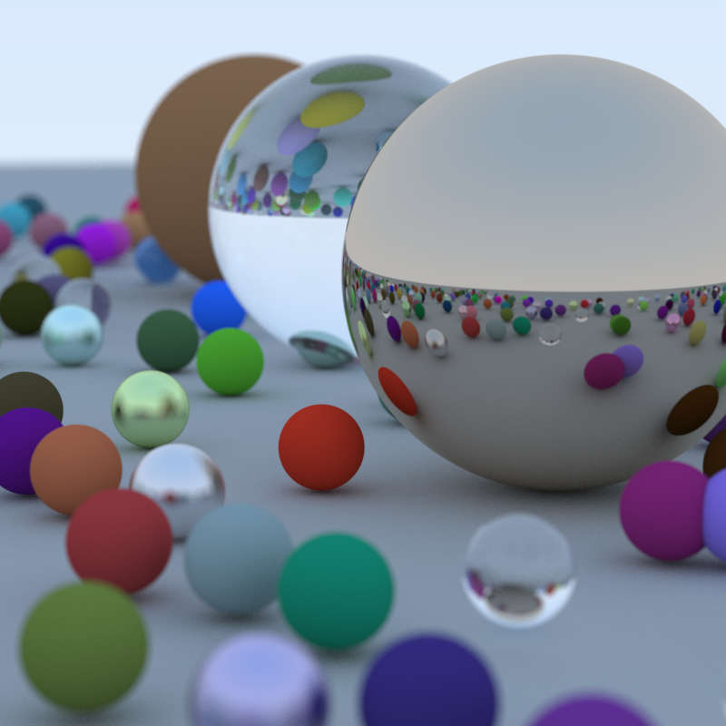

# Week 2  Ray Tracing in One Weekend

* 设置viewport，找到左上角.
* 设ray的颜色线性变化，渲染得到渐变的图.
* 通过直线与圆的关系在画面中加入一个圆. 根据法线设置球的颜色.
* 新建hit.rs，存储可以被击中的物体(hittable)，并标记击中的方向(HitRecord).
* 新建球的类，sphere.rs(继承hittable的trait).
* 新建hit_list.rs，记录所有可以被击中的物体.
* 新建interval.rs，处理区间操作.
* 将设置窗口、渲染图片单独整理为camera结构体的impl，新建camera.rs.
* 通过多重取样抗锯齿化.

  

* 用random vector处理漫反射. 得到first render!

* 控制光线反射次数，提高效率.
* 解决精度误差引起的shadow acne.
* 根据Lambertian分布处理反射光.
* 调整反射光光强.
* gammar correction. 转换到gamma空间.
* 新建material.rs. 记录球的材质. 进行相应修改.
* material中实现lambertian(漫反射材质)，metal(镜像反射)，dielectric(折射)三种.
* metal需处理fuzziness.
* dielectric处理全反射. use Schlick Approximation.
* 空心玻璃球.
* 调整相机视角.
* 调整相机位置和方向.
  

* 考虑光圈. Defocus blur.

* Final Render!

commit: 538af9a
