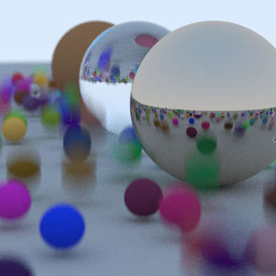
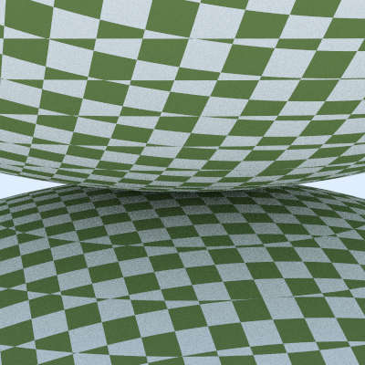
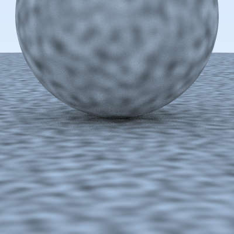
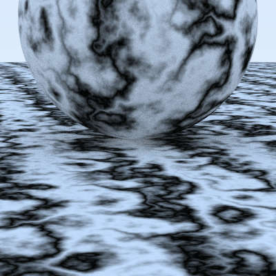
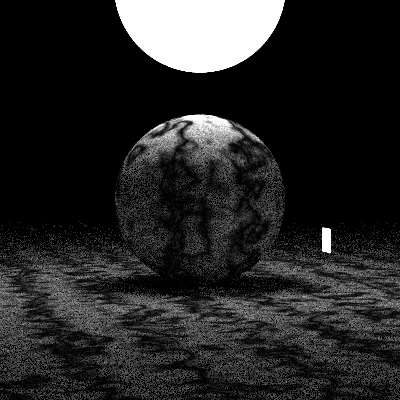
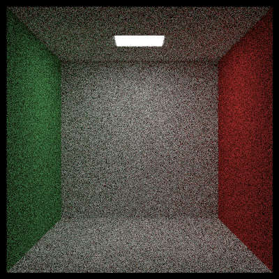
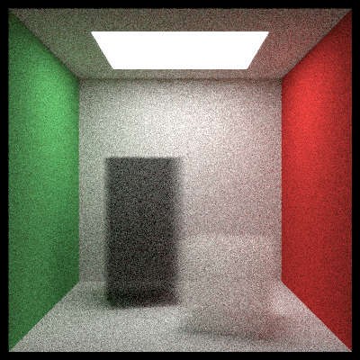
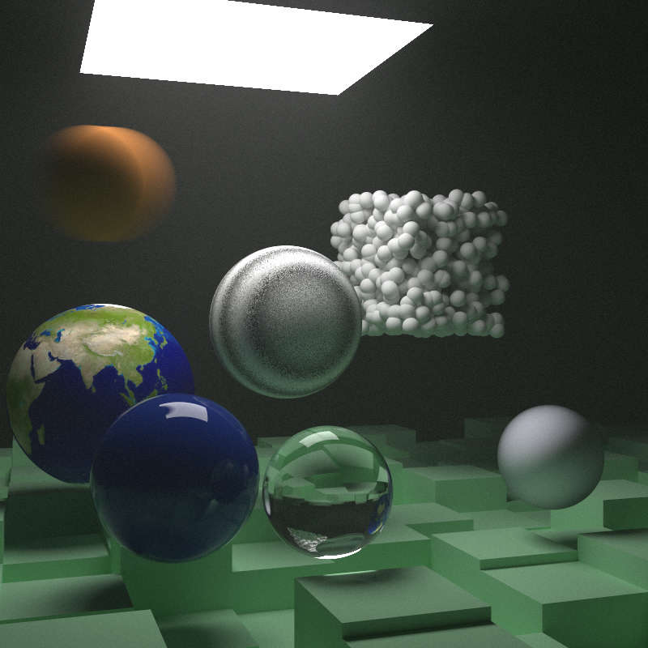

# Week 3  Ray Tracing: The Next Week

* 根据时间渲染动态物体的模糊.

  

* 增加AABB和bvh，运行速度显著提升.
* 新建texture.rs，渲染纹理.

* 新建rtw.rs，导入图片. 连接stb库，包装stb_image.h，成功让rust使用c头文件.
  * fix: 直接用opencv::imgcodecs::imread.
* 加入perlin noise. Hermitian Smoothing.

* terbulence.
* 新增quad类.
* 新增light emitting material.

* 渲染cornell box.

* move and rotate box.
* add volumes.

* final picture.

* 实现多线程.

commit: e77d4ecb1b
