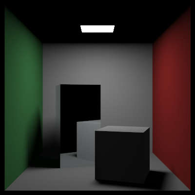
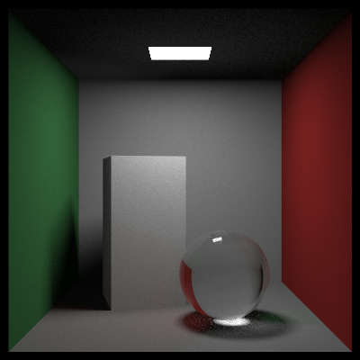

# week 4

## Ray Tracing: The Rest of Your Life

- 通过蒙特卡罗方法取样. 降低噪声.

- 实现各种probability density function.
- 整合pdf类.
- 单独处理lights的不同密度的取样.

p.s. 这两张图中大盒子是黑的，因为是后期重新渲染的图，方便起见，直接使用了“不反光的金属”材质.

- 实现物体和光线的 mixture sample.

- 实现任意材质的pdf！铝制镜面.

- 实现球体的pdf. 渲染玻璃球.

